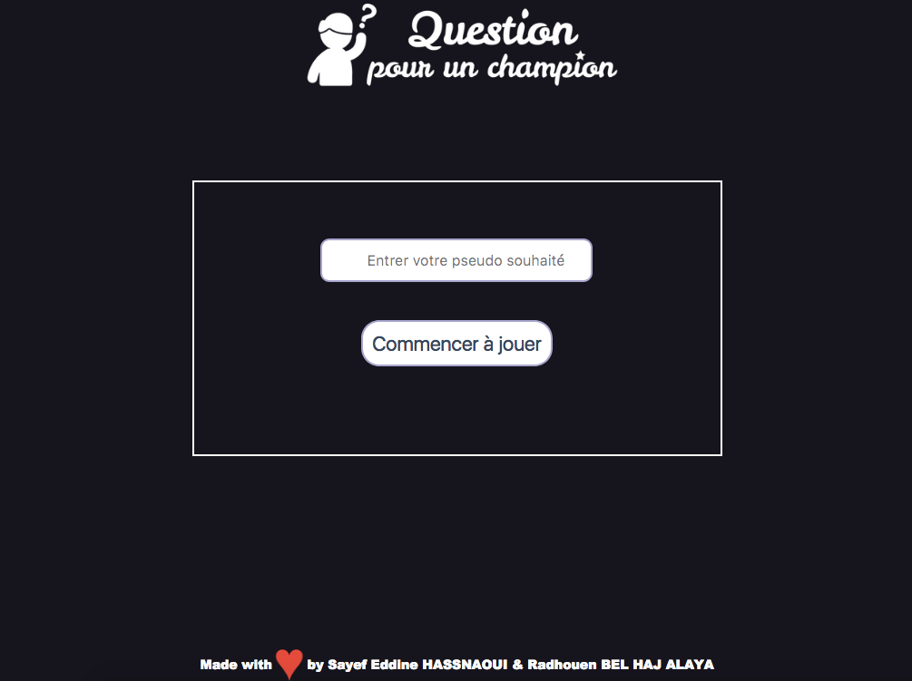
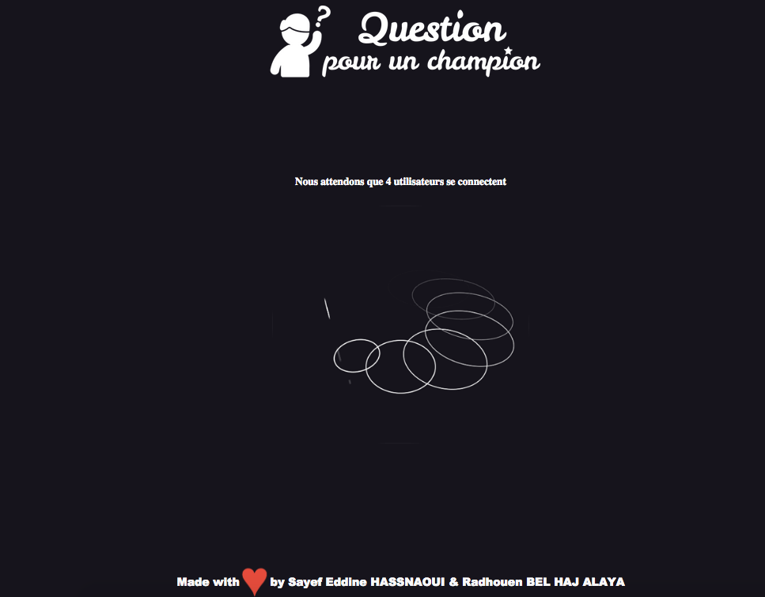
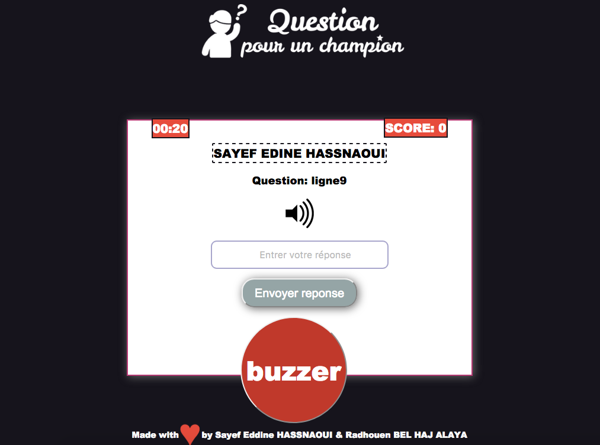
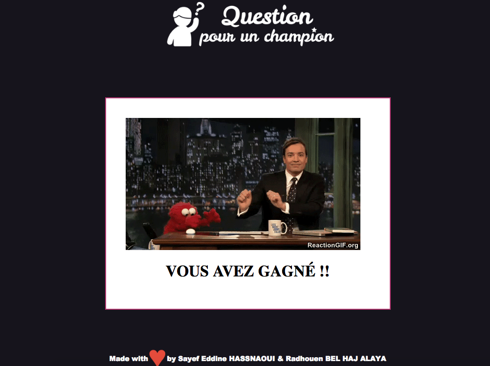
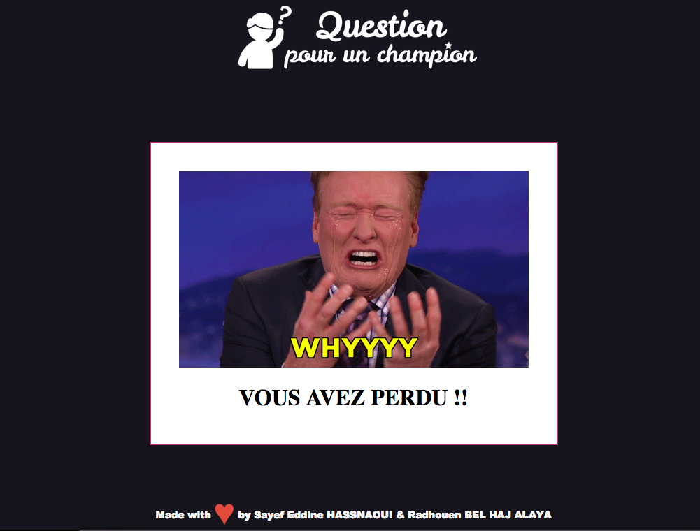

# Question-Pour-un-Champion
Questions pour un champion (Going for gold) est un jeu télévisé français d'origine britannique produit sous licence de la société Fremantle Media, diffusé sur FR3 puis France 3 depuis le 7 novembre 1988 et rediffusé sur TV5 Monde.
Quatre candidats sont en lice et doivent répondre à des questions de culture générale.
Le principe de jeux est assez simple, quatre candidates doivent se présenter au système pour que le jeu commence.
Les quatre candidats doivent répondre rapidement à une série de questions, en appuyant sur un buzzer. Lors de l'énoncé de la question, le candidat qui prend la main et donne la bonne réponse remporte 10 points. S'il se trompe ou met trop de temps à répondre (par défaut 20 secondes), un signal sonore d'erreur retentit, le candidat perd la main et le système passe à la question suivant. Les autres candidats ne peuvent pas appuyer sur le buzzer si la main est déjà donnée à un candidat.
Le candidat qui atteint le nombre maximum des points définit par l’administrateur de système, gagne le jeu.

Ce projet est developpé a l'aide de NodeJS

Quelque screenshot du projet:

